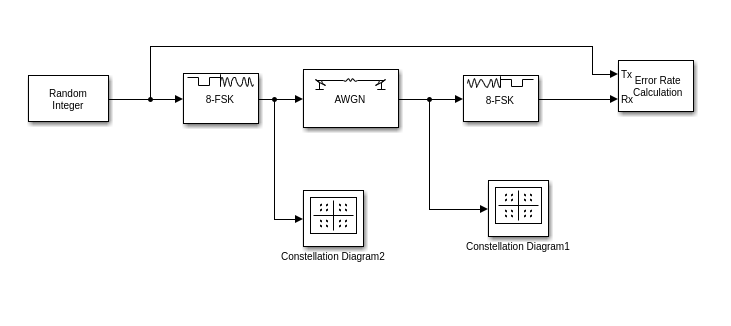
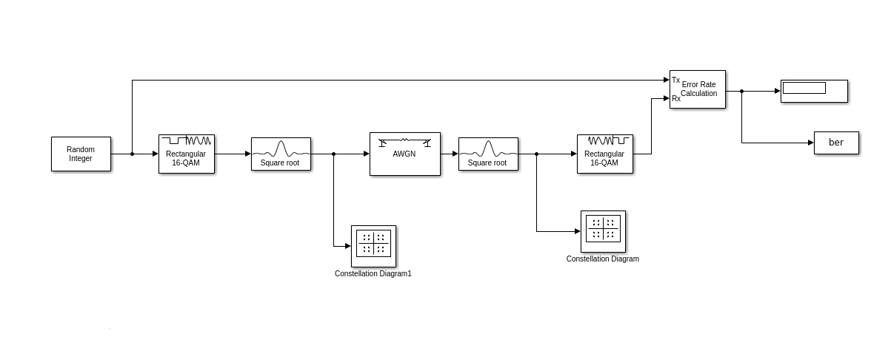

# Bpsk(binary phase shift keying): 
## Description: 
It is a type of phase shift keying modulation ,mainly it is based on sending the information within the   phase of the carrier (sin or cosine).It involves changing the phase of the transmitted waveform instead of the frequency, and these finite phase changes represent digital data. In its simplest form, a phase-modulated waveform can be generated by using the digital data to switch between two signals of equal frequency but opposing phase. If the resultant waveform is multiplied by a sine wave of equal frequency, two components are generated: one cosine waveform of double the received frequency and one frequency-independent term whose amplitude is proportional to the cosine of the phase shift. Thus, filtering out the higher-frequency term yields the original modulating data prior to transmission.bpsk is called binary since it uses two phases.
    
### set of instructions for the block diagram: 
#### General Parameters: 
* The noise level is set to 10 dB. 
* The simulation period is set to 100. 
##### Random integer block parameters: 
* set-size=2 
* sample frame =100 
* Phase offset (rad) = 0 
* sampletime=0.1 sec  
* Initial seed = Auto
##### AWGN channel  block parameters: 
* Initial seed = 67 
* Number of bits per symbol = 1 
* Input signal power = 1 
* Symbol period = 1s 

###### constellation diagram(before noise)

###### constellation diagram(after noise)

    
    

# Qpsk(Quadratre phase shift keying): 
## Description: 
It is a type of phase shift keying modulation ,mainly it is based on sending the information within the phase of the carrier (sin or cosine).It involves changing the phase of the transmitted waveform instead of the frequency, and these finite phase changes represent digital data. In its simplest form, a phase-modulated waveform can be generated by using the digital data to switch between two signals of equal frequency but opposing phase. If the resultant waveform is multiplied by a sine wave of equal frequency, two components are generated: one cosine waveform of double the received frequency and one frequency-independent term whose amplitude is proportional to the cosine of the phase shift. Thus, filtering out the higher-frequency term yields the original modulating data prior to transmission.QPSK is called Quadratre since it uses 4 phases.
With QPSK, the carrier undergoes four changes in phase (four symbols) and can thus represent 2 binary bits of data per symbol.
### set of instructions for the block diagram:     
#### General Parameters: 
* The noise level is set to 10 dB. 
* The simulation period is set to 100. 
##### Random integer block parameters: 
* set-size=4 
* sample frame =100 
* Phase offset (rad) = 0 
* sampletime=1sec  
* Initial seed = Auto
##### AWGN channel  block parameters: 
* Initial seed = 67 
* Number of bits per symbol = 1 
* Input signal power = 1 
* Symbol period = 1s 

###### constellation diagram(before noise)

###### constellation diagram(after noise)

# Fsk(Frequency shift keying):  
## Description: 
It is a type of frequency modulation ,it differs from analog FM by using a digital signal as the input to the frequency modulator, the information is conveyed also through the phase of the signal but depending on the frequency variation this time. Thus, the output takes the form of a sine wave at two distinct frequencies. To demodulate this waveform, it is a simple matter of passing the signal through two filters and translating the resultant back into logic levels. 
### set of instructions for the block diagram:     
#### General Parameters: 
* The noise level is set to 10 dB. 
* The simulation period is set to 100. 
* Frequency separation = 6 Hz
* Samples per symbol = 17
##### Random integer block parameters: 
* set-size=8 
* sample frame =100 
* sampletime=1sec  
* Initial seed = Auto
##### AWGN channel  block parameters: 
* Initial seed = 67 
* Number of bits per symbol = 1 
* Input signal power = 1 
* Symbol period = 1s 

###### constellation diagram(before noise)

###### constellation diagram(after noise)

    
    

# QAM(Quadrature amplitude modulation): 
## Description: 
It conveys two analog message signals, or two digital bit streams, by changing (modulating) the amplitudes of two carrier waves, using the amplitude-shift keying (ASK) digital modulation scheme or amplitude modulation (AM) analog modulation scheme. The two carrier waves of the same frequency are out of phase with each other by 90°, a condition known as orthogonality and as quadrature. Being the same frequency, the modulated carriers add together, but can be coherently separated (demodulated) because of their orthogonality property.
### for QAM-16: 
#### set of instructions for the block diagram: 
##### General Parameters: 
* The noise level is set to 10 dB. 
* The simulation period is set to 100. 
* Normalization method = Average Power
* Phase offset (rad) = 0
* Average power referenced to 1 Ohm = 1 Watts
###### Random integer block parameters: 
* set-size=16 
* sample frame =100 
* Phase offset (rad) = 0 
* sampletime=0.1 sec  
* Initial seed = Auto
###### AWGN channel  block parameters: 
* Initial seed = 67 
* Number of bits per symbol = 1 
* Input signal power = 1 
* Symbol period = 1s  

### for QAM-64: 
#### set of instructions for the block diagram: 
##### General Parameters: 
* The noise level is set to 10 dB. 
* The simulation period is set to 100. 
* Normalization method = Average Power
* Phase offset (rad) = 0
* Average power referenced to 1 Ohm = 1 Watts
###### Random integer block parameters: 
* set-size=64 
* sample frame =100 
* Phase offset (rad) = 0 
* sampletime=0.1 sec  
* Initial seed = Auto
###### AWGN channel  block parameters: 
* Initial seed = 67 
* Number of bits per symbol = 1 
* Input signal power = 1 
* Symbol period = 1s  

###### constellation diagram(before noise)

###### constellation diagram(after noise)

###### constellation diagram(before noise)

###### constellation diagram(before noise)

    
    

## BER performance analysis: 
### using bertool 
* bpsk BER:

* qpsk BER:

* fsk BER:

* QAM16 BER:

* QAM64 BER:

## Using Raised cosine
### parameters:
Reciever delay in Error-calculation=10  
Filter span in symbols=10 
Rolloff factor=0.2 
### Modules:
* Bpsk :

* Qpsk:

* Fsk :

* QAM16:

* QAM64:

### ber
* Bpsk ber:

* Qpsk ber:

* Fsk ber :

* QAM16 ber:

* QAM64 ber:

